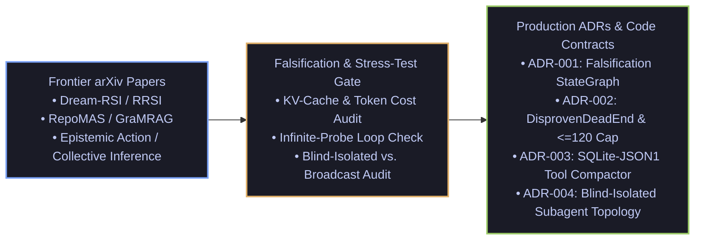

# Agentic Systems Engineering Radar & ADRs

**Curated by Mario Hu (`@mariohu-fde`) — AI Systems & Cloud Solutions Engineer | Data & AI @ Google Cloud**

Distilling frontier `arXiv` agentic systems papers into **production-grade control-plane mechanisms, falsification trade-off matrices, and Architecture Decision Records (ADRs)**.

---

## Why This Repository Exists

Academic agent papers frequently optimize for benchmark leaderboards while ignoring enterprise production constraints: **context-window inflation**, **Prefix KV-cache invalidation**, **hypothesis anchoring in multi-step debugging**, and **unstructured memory rot**.

Every synthesis and ADR in this repository enforces a 3-step **Systems Engineering Filter**:
1. **Failure Mode**: What concrete production bottleneck does this paper address, and where do the authors' assumptions break under real cloud telemetry?
2. **Control-Plane Mechanism**: How do we isolate **Epistemic Actions** (read-only diagnostic probing) from **Pragmatic Actions** (state mutation) using deterministic code rather than prompt wishes?
3. **Executable Contract**: How does it map into runnable `Pydantic V2` / `LangGraph` / `SQLite-JSON1` code in [`cloudops-autonomous-agent`](https://github.com/mariohu-fde/cloudops-autonomous-agent)?

---

## Architecture Decision Records (ADRs)

| ADR | Decision Summary | Primary Bottleneck Solved |
| :--- | :--- | :--- |
| **[ADR-001](adrs/ADR-001-falsification-first-stategraph.md)** | **Falsification-First StateGraph over Open-Ended ReAct Loops** | Prevents single-agent confirmation bias on ambiguous cloud telemetry by requiring explicit hypothesis disproof before remediation. |
| **[ADR-002](adrs/ADR-002-negative-knowledge-dead-end-contracts.md)** | **Negative-Knowledge (`DISPROVEN_DEAD_END`) & `<=120` Line Constitutional Cap** | Blocks agents from re-probing falsified root causes and prevents long-term skill library bloat (`Total Cost of Agency`). |
| **[ADR-003](adrs/ADR-003-sqlite-json1-tool-output-compaction.md)** | **Zero-Bloat Tool Output Compaction via Out-of-Band `SQLite-JSON1`** | Intercepts `>1,500` char JSON tool dumps, preserves full evidence out-of-band, and emits bounded `<400-token` digests with `payload_ref` handles. |
| **[ADR-004](adrs/ADR-004-blind-isolated-subagent-topologies.md)** | **Blind-Isolated Subagent Probing over All-to-All Broadcast** | Eliminates multi-agent groupthink (`arXiv:2610.05041`) and top-level config illusions by isolating parallel probers until evidence converges at the falsification gate. |

---

## Curated Research Synthesis Catalog

### 1. Harness Dominance over Model Scale & Precondition State-Machine Gates (`2026-10-08`)
- **[Harness Dominance over Model Scale & Precondition State-Machine Gates](digests/2026-10-08_harness-dominance-and-state-machine-gates.md)**
  - **Papers Evaluated**: *Agents Are Systems, Not Models: Rethinking Agentic Evaluation* (`arXiv:2610.01618`), *SchemaFill: Efficient LLM Tool Calling via Slot-Parallel Speculative Decoding* (`arXiv:2610.07086`).
  - **Systems Engineering Verdicts**:
    - **Harness Preconditions Dominate Parameter Scale**: Across 18,000+ trajectories, context hygiene and deterministic state-transition gates (`CleanUpFailedMutation -> CleanUpMutations -> MigratePipeline`) outweigh base model upgrades.
    - **Client-Side Schema Flattening & Post-Migration Orphan Audits**: Flattening Pydantic tool schemas replicates slot-parallel decoding speedups on managed endpoints, while post-migration verification prevents orphaned worker pools (`is_async_pipeline: false`) and premature long-tail incident closure.

### 2. Deterministic Evidence Compilers & Blind-Isolated Subagent Topologies (`2026-10-07`)
- **[Deterministic Evidence Compilers & Blind-Isolated Subagent Topologies](digests/2026-10-07_evidence-compilers-and-isolated-topologies.md)**
  - **Papers Evaluated**: *FinNextAssist: Towards Professional Financial Deep Research Assistant* (`arXiv:2610.03174`), *Communication Shapes Collective Inference in Self-Adapting LLM Societies* (`arXiv:2610.05041`).
  - **Systems Engineering Verdicts**:
    - **Deterministic `SQLite-JSON1` Evidence Preprocessor over LLM Compilers**: Compressing raw tool outputs into `<400-token` digests with provenance pointers (`payload_ref`) reduces context noise by ~70% without adding an extra LLM inference pass.
    - **Blind-Isolated Subagent Probing over All-to-All Broadcast**: Preventing parallel diagnostic subagents from reading each other's intermediate hypotheses preserves collective error correction and avoids premature groupthink.

### 3. Epistemic Action Gates & Typed State Substrates (`2026-10-06`)
- **[Epistemic Action Gates & Typed State Substrates](digests/2026-10-06_epistemic-actions-and-substrate-inversion.md)**
  - **Papers Evaluated**: *Before Agents Decide: Epistemic Action in LLM-Based Systems* (`arXiv:2610.00511`, NeurIPS 2026 FAST), *The Agentic Company OS: Substrate Inversion* (`arXiv:2609.13334`).
  - **Systems Engineering Verdicts**:
    - **Hard Epistemic-to-Pragmatic Gate**: Isolating read-only diagnostic probing from state-mutating operations via explicit state-machine transitions to eliminate infinite probing loops.
    - **Immutable ID Correlation over Positional Offsets**: Why binding streaming evaluation traces or multi-agent state by array index (`Trace[k]`) rather than immutable primary keys (`turn_id` / `payload_ref`) causes silent evaluation skew when intermediate turns drop.

### 4. Self-Evolving Agent Harnesses & Counterfactual Memory (`2026-09-29`)
- **[Self-Evolving Harnesses, Counterfactual Replay & Constitutional Caps](digests/2026-09_self-evolving-agents-and-counterfactual-replay.md)**
  - **Papers Evaluated**: *Dream-RSI* (`arXiv:2609.14858`), *RRSI / Total Cost of Agency* (`arXiv:2609.23790`), *RetireOPD* (`arXiv:2609.20784`), *SWE-Router* (`arXiv:2607.00053`).
  - **Systems Engineering Verdicts**:
    - **Negative-Knowledge Contracts (`DISPROVEN_DEAD_END`)**: Recording falsified hypotheses with hard telemetry evidence prevents multi-agent confirmation loops.
    - **Counterfactual Replay Gate (`CF_Value`)**: Scoring candidate playbook rules against historical traces before promotion.
    - **The `<= 120` Line Constitutional Cap**: Enforcing overflow consolidation so long-term agent memory never degrades instruction following.

### 5. Multi-Agent Falsification & Graph-Augmented Retrieval (`2026-09-30`)
- **[Falsification-First Multi-Agent DAGs & Graph-Augmented RAG](digests/2026-09_falsification-dags-and-graph-rag.md)**
  - **Papers Evaluated**: *RepoMAS* (`arXiv:2609.11790`), *GraMRAG* (`arXiv:2609.14066`), *SAGE* (`arXiv:2609.35412`).
  - **Systems Engineering Verdicts**:
    - **Anti-Anchoring Prompting (`FAILED_ATTEMPT`)**: Framing prior agent steps as unverified attempts that must be falsified against hard telemetry.
    - **Readiness Gate (`should_decompose`)**: Dynamic complexity gating to bypass multi-agent overhead on deterministic single-hop incidents.

### 6. Context Compaction, Gated Memory & Tool Hygiene (`2026-09-23`)
- **[5-Tier Context Compaction & Schemaless SQLite-JSON1 Tool Reduction](digests/2026-09_context-compaction-and-gated-memory.md)**
  - **Papers Evaluated**: *Gated-Memory Routing* (`LongMemEval-V2`), *Refining Over Resampling* (`arXiv:2608.05643`), *Structured Output Quality Tax*.
  - **Systems Engineering Verdicts**:
    - **Prefix KV Cache Preservation**: Keeping system prompts static mid-trajectory to avoid 5–10x TTFT latency and cost penalties.
    - **Decoupled Reasoning vs. Formatting**: Separating free-form root-cause analysis from strict JSON schema serialization.
