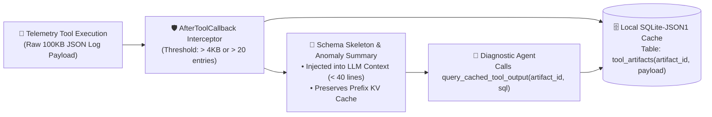

# 🗜️ 5-Tier Context Compaction & Schemaless `SQLite-JSON1` Tool Reduction

> **Synthesis Date**: September 2026  
> **Primary Literature**: *Gated-Memory Routing* (`LongMemEval-V2`), *Refining Over Resampling* (`arXiv:2608.05643`), *Structured Output Quality Tax*  
> **Reference Implementation**: [`cloudops-autonomous-agent/src/cloudops_agent/middleware/tool_compactor.py`](https://github.com/mariohu-fde/cloudops-autonomous-agent)

---

## 1. Executive Summary

In cloud infrastructure troubleshooting, a single telemetry tool call (e.g., querying distributed container logs or RPC latency histograms) frequently returns `50KB–500KB` of nested JSON. Appending raw tool payloads directly into the LLM message history causes immediate **Attention Dilution** and triggers premature context-window exhaustion.

Instead of naive string truncation (which slices off critical error stack traces at the tail of the payload), we implement **Out-of-Band Artifact Caching with Schemaless `SQLite-JSON1` Reduction**.

---

## 2. Architecture: The `AfterToolCallback` Compaction Loop

---

## 3. Core Engineering Mechanisms

1. **Prefix KV Cache Invariance**:
   - Never rewrite or summarize the system prompt or early trajectory prefix on every turn. Keep the prefix immutable so LLM serving engines maintain a `>90%` Prefix KV Cache hit rate.
2. **Schema Skeleton Extraction**:
   - When a tool output exceeds the byte/row budget, the interceptor extracts:
     - Total record count and byte size;
     - Top-level and nested JSON key paths with inferred value types;
     - Automated grouping of severity/status counts (e.g., `ERROR: 14`, `OK: 86`);
     - 2 representative sample records.
3. **Zero-Dependency `sqlite3` `json_each` Querying**:
   - Using Python's standard library `sqlite3` module (`json_each` and `json_extract`), the agent can execute surgical SQL filters against cached JSON arrays (e.g. `SELECT value FROM json_each(payload) WHERE json_extract(value, '$.severity') = 'ERROR'`) without re-loading the full payload into the LLM prompt.
