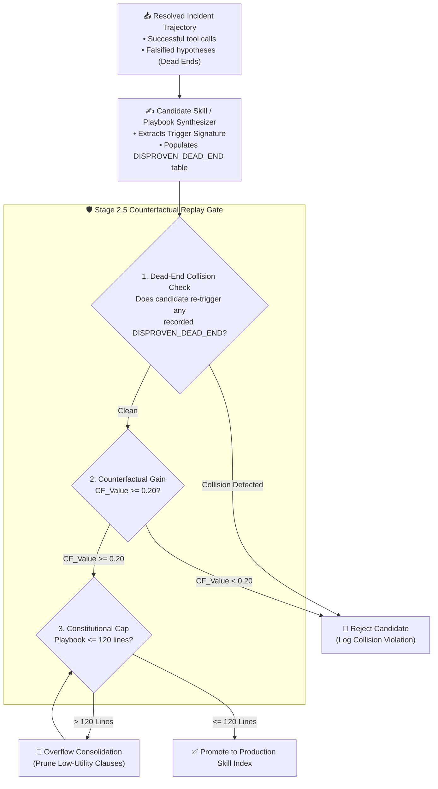

# 🧠 Self-Evolving Harnesses, Counterfactual Replay & Constitutional Caps

> **Synthesis Date**: September 2026  
> **Primary Literature**: *Dream-RSI* (`arXiv:2609.14858`), *RRSI: Total Cost of Agency* (`arXiv:2609.23790`), *RetireOPD* (`arXiv:2609.20784`), *SWE-Router* (`arXiv:2607.00053`)  
> **Reference Implementation**: [`cloudops-autonomous-agent/src/cloudops_agent/evals/replay_scorer.py`](https://github.com/mariohu-fde/cloudops-autonomous-agent)

---

## 1. Executive Summary

Self-evolving agent harnesses that continuously append "lessons learned" to their system prompts or skill libraries suffer from **Instruction Entropy**—after 50+ incidents, the accumulated rules contradict one another, inflate prompt token costs, and degrade reasoning accuracy below the zero-shot baseline (*Total Cost of Agency*, `arXiv:2609.23790`).

To achieve sustainable self-improvement in cloud incident troubleshooting, an agent harness requires three structural gates:
1. **Explicit Negative-Knowledge Contracts (`DISPROVEN_DEAD_END`)**: Capturing falsified diagnostic paths alongside verified root causes.
2. **Stage 2.5 Counterfactual Trajectory Replay (`CF_Value`)**: Proving that a distilled skill measurably reduces diagnostic steps on held-out trajectories without colliding with known dead ends.
3. **Constitutional Line Cap (`<= 120` Lines)**: Enforcing a hard upper bound on active playbook length via automated overflow consolidation.

---

## 2. System Architecture: Stage 2.5 Counterfactual Replay Pipeline

---

## 3. Core Engineering Mechanisms

### 3.1 Negative Knowledge (`DISPROVEN_DEAD_END`)
Standard post-mortems record only the final root cause. When a similar symptom recurs, a stateless agent wastes 5–10 tool calls re-investigating the same seductive red herrings. By elevating `DisprovenDeadEnd` to a first-class Pydantic contract (`hypothesis_id`, `falsified_claim`, `telemetry_proof_ref`, `avoid_tool_signature`), the orchestrator injects explicit negative constraints into downstream prompts.

### 3.2 Counterfactual Value ($\text{CF\_Value}$)
Given a baseline trajectory requiring $S_{\text{base}}$ diagnostic steps and a replay trajectory with the candidate skill requiring $S_{\text{skill}}$ steps:

$$\text{CF\_Value} = \frac{S_{\text{base}} - S_{\text{skill}}}{S_{\text{base}}}$$

A candidate playbook is promoted only if $\text{CF\_Value} \ge 0.20$ (at least a 20% reduction in tool invocations) and **Dead-End Collision Count = 0**.

### 3.3 The `<= 120` Line Constitutional Cap (*RRSI*)
As demonstrated in *RRSI* (`arXiv:2609.23790`), unconstrained self-reflection loops suffer from monotonic context bloat. Enforcing a strict `<= 120` line cap per domain playbook forces the consolidation engine to merge redundant rules and retire low-frequency heuristics.

---

## 4. Trade-Off Matrix

| Improving Parameter | Worsening Parameter | Architectural Constraint |
| :--- | :--- | :--- |
| Multi-step diagnostic precision & zero repeat dead ends | Offline distillation compute overhead | Replay runs asynchronously post-incident (Stage 2.5), never blocking live P1 triage |
| Stable prompt latency & Prefix KV Cache hit rate | Granularity of rare edge-case instructions | Hard `<= 120` line cap per active playbook; cold edge cases stay in vector RAG |
